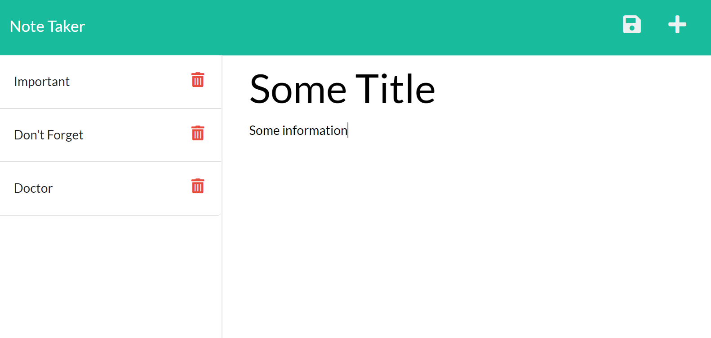

# Notes

## Description
Notes is a note taking app that allows the user to create a note that is then stored in the database.  Once created, the user can select the notes to read them or click on delete to remove the note from the database.

## Table of Contents

[Links](#links)

[Media](#media)

[Installation](#installation)

[Usage](#usage)

[License](#license)

[Contributing](#contributing)

[Tests](#tests)

[Questions](#questions)

## Links
[Notes App](https://notes-bh.herokuapp.com/)

## Media

## Installation
To install the necessary dependencies, run the following command:

    npm install

## Usage
Creating notes is simple and easy, but there is no undo for deletion, so be careful.

## License
This product is licensed under MIT

## Contributing
No contributions at this time.

## Tests
To run tests, run the following command:

    npm test

## Questions
If you have any questions about the repo, open an issue or contact me directly at <brian.t.halpin@gmail.com>. You can find more
    of my work at [Brian Halpin](https://github.com/bthalpin).
